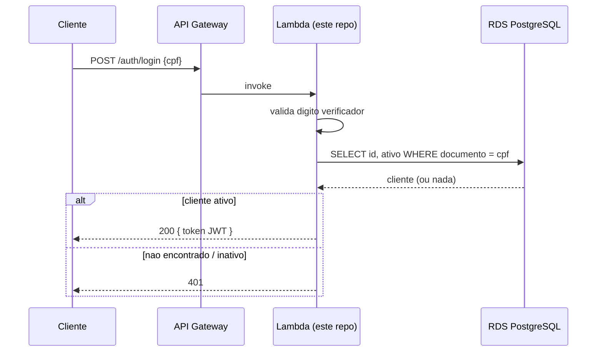

# oficina-mecanica-auth

Function Serverless de autenticação de clientes via CPF do projeto **OficinaMecanica** — Fase 3 do Tech Challenge (POS TECH/FIAP).

## O que este repositório faz

`POST /auth/login` com `{ "cpf": "..." }`:

1. Normaliza e valida o dígito verificador do CPF (reimplementação isolada — este repositório é um deploy independente e não referencia o projeto Domain do repositório principal)
2. Consulta o RDS PostgreSQL (repositório `oficina-mecanica-infra-db`) direto via Npgsql: `SELECT id, ativo FROM clientes WHERE regexp_replace(documento,'[^0-9]','','g') = @cpf`
3. Não encontrado ou inativo → `401`. Ativo → emite um JWT HS256 com o **mesmo** `Issuer`/`Audience`/`SecretKey` já configurados no `appsettings.json` da API principal, para ser validado sem nenhuma mudança no middleware `AddJwtBearer` já existente



## Infraestrutura (Terraform, `terraform/`)

- Lambda `.NET 8` (`Amazon.Lambda.AspNetCoreServer.Hosting`, estilo Minimal API), dentro da VPC do repositório `oficina-mecanica-infra-db` (subnets privadas, localizadas via `data source` por tag)
- Execution role: `LabRole` já existente na conta (AWS Academy Learner Lab bloqueia criação de IAM role nova)
- API Gateway HTTP API: `POST /auth/login` → Lambda; `ANY /{proxy+}` → proxy HTTP direto para o Elastic IP do repositório `oficina-mecanica-infra-k8s` (sem VPC Link/NLB — custo evitado, ver ADR correspondente)

## Como rodar/testar localmente

```bash
dotnet test
dotnet run --project src/OficinaMecanica.Auth
```

## CI/CD

Workflow em `.github/workflows/ci-cd.yml`: build + testes unitários (`CpfValidatorTests`) em toda PR e push; empacota o Lambda (`dotnet publish` + `zip`); `terraform plan` comentado no PR; `terraform apply -auto-approve` no merge em `main`.

Secrets necessários: `AWS_ACCESS_KEY_ID`, `AWS_SECRET_ACCESS_KEY`, `AWS_SESSION_TOKEN`, `DB_USERNAME`, `DB_PASSWORD` (mesmos valores do repositório `oficina-mecanica-infra-db`), `JWT_SECRET_KEY` (mesmo valor do `appsettings.json` da API principal), `APP_PUBLIC_IP` (Elastic IP do repositório `oficina-mecanica-infra-k8s`).

## State remoto

State em S3 (`oficina-mecanica-tfstate-159157616728`, key `auth/terraform.tfstate`), mesmo bucket compartilhado com os demais repositórios Terraform do projeto.
